## Table of Contents

<!-- @import "[TOC]" {cmd="toc" depthFrom=1 depthTo=6 orderedList=false} -->

<!-- code_chunk_output -->

- [Table of Contents](#table-of-contents)
- [Logging in](#logging-in)
- [Opening your character sheet](#opening-your-character-sheet)
- [Importing your character](#importing-your-character)
- [Populating/using the hotbar](#populatingusing-the-hotbar)
- [Combat](#combat)
- [Character Sheet](#character-sheet)
- [Resting](#resting)
- [Keyboard Shortcuts](#keyboard-shortcuts)
- [Performance Issues](#performance-issues)

<!-- /code_chunk_output -->

## Logging in

Choose your user and login with your password (shared offline).

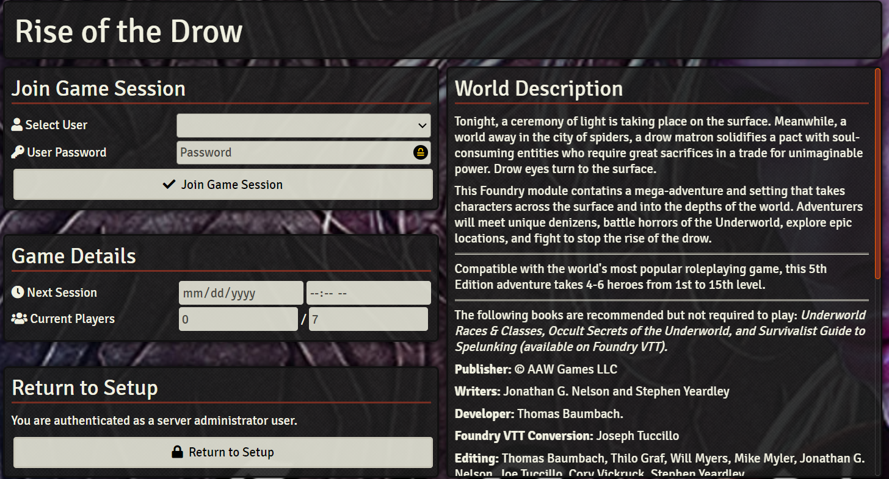

## Opening your character sheet

1. Find your token on the map and double click

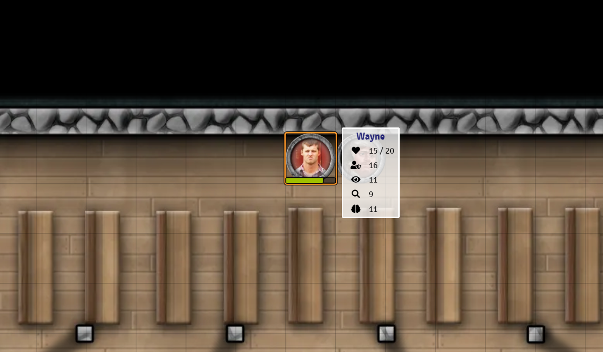

2. Find your actor on the actor tab

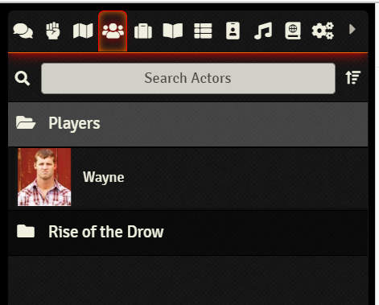

## Importing your character

So you updated your character on D&D beyond and want to pull changes over to foundry? Great!

1. Click on the black D&D Beyond button next to your character name

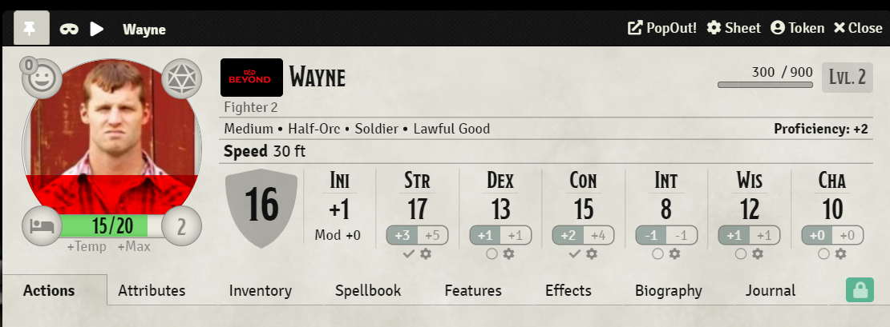

2. Click on start import. Don't press anything else in this window unless you know what you're doing. :)

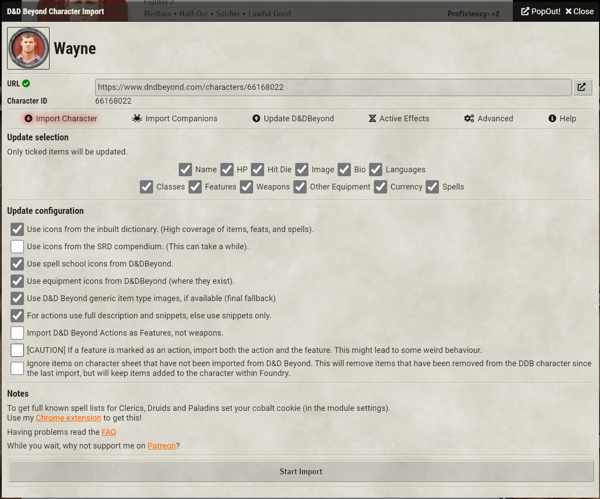

## Populating/using the hotbar

1. To add an item to the hotbar, click and drag the item from your character sheet and drop it into the slot you want it on the hotbar

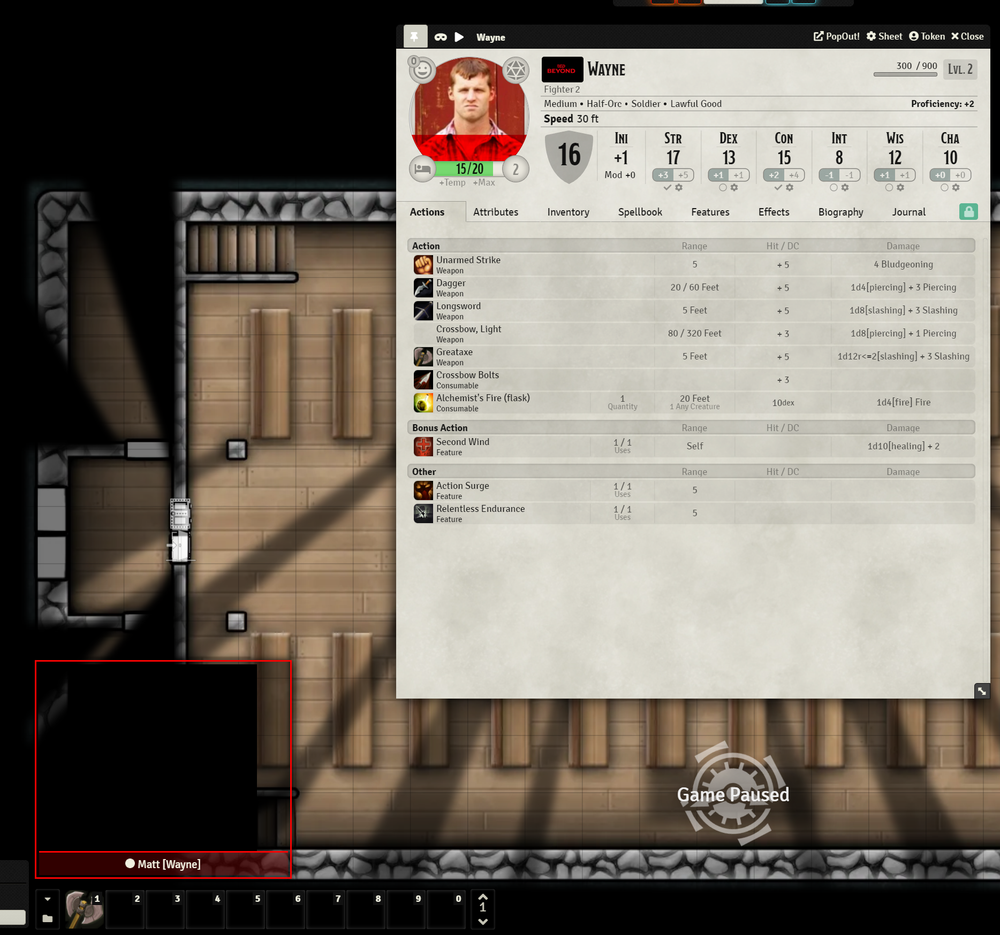

2. Click on the item to use it. That's it! Advantage/disadvantage modifiers also apply here. 

3. Click on number on the very right side of the hotbar to have it fly out and expand. You can setup up to 5 hotbars of items. If you need more than that, you might have a problem but talk to me. :)

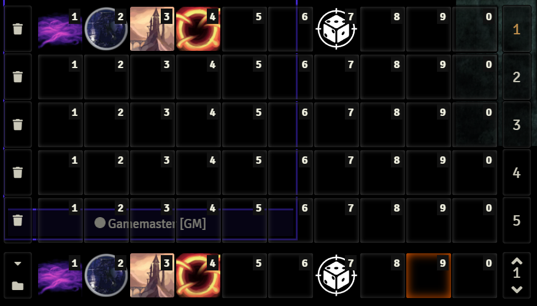

## Combat

1. Initiative - When the DM says so, click the "Ini" button right next to your AC.

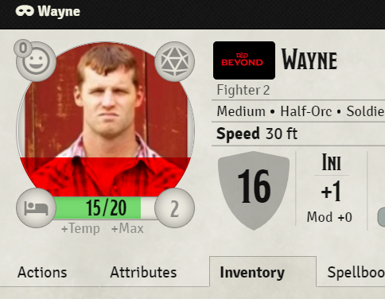

2. Targeting is *required* for making attacks in combat. In order to target, hold ALT (Windows) or OPTION (MacOS) and select the enemy token to attack. This allows me, as DM, to setup a lot more automation so combat moves more smoothly. You will end up with a target on the character token you are attempting to attack. Now you can roll your attack. You won't be able to attack unless you do this!

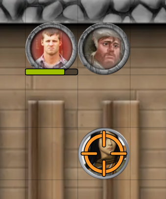

3. Attacking - After targeting, choose your attack and click on either the hotbar or on your charater sheet to roll. Everything should happen automatically. If you were successful, you will see a card like this, which show you what your attack/damage rolls were. You can click on either of the roll formulas to see exactly what dice were rolled. 

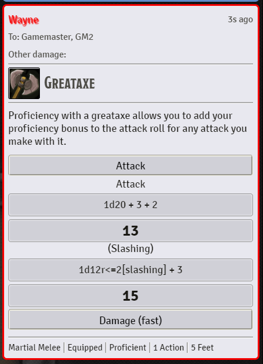

4. Advantage/disadvantage - Rolling with advantage can be achieved by holding ## shift** while clicking your attack button/hotbar. Rolling with disadvantage can be achieved by holding **control (Windows)/command (MacOS) while clicking your attack button/hotbar. Using a versatile attack can be done by holding V while attacking. Versatile attacks are like for a Longsword which can be wielded with 1 or 2 hands. The versatile attack would be done with 2 hands. If you want 2-handed to be the default and 1-handed to be versatile, talk with me and we can get this fixed up. :)

5. Movement - When it is your turn, drag and drop your token to where you want to go. If your movement is being restricted, possibly by a wall or other charater, move around those. While moving your token, you can see how far you have moved so far this turn. Green represents your normal movement speed (unless in difficult terrain), yellow would be if you have teh ability to dash, either as a Bonus Action like a Rogue/Monk with Ki or as an Action dash. 
a. Click your space bar to add waypoints to your move if you want to maneuver around walls. Right click to undo creating those waypoints.
b. If you still can't get your token to move, either tell the DM to unpause the game, get it back on your turn or just have them move you. :)

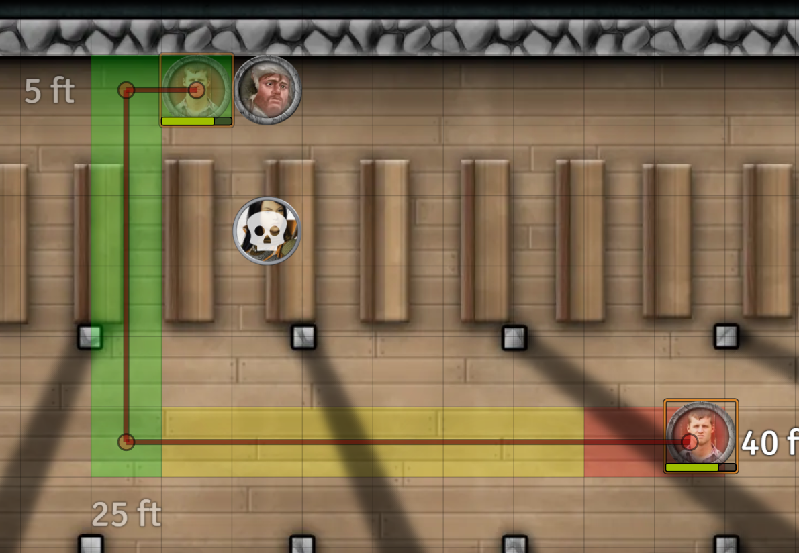

## Character Sheet

1. Adding favorites - Right click an item on your sheet and select "Add Favorite" to get it added to show up in the Attributes page. The Actions page is pre-populated with a bunch of combat-specific actions.

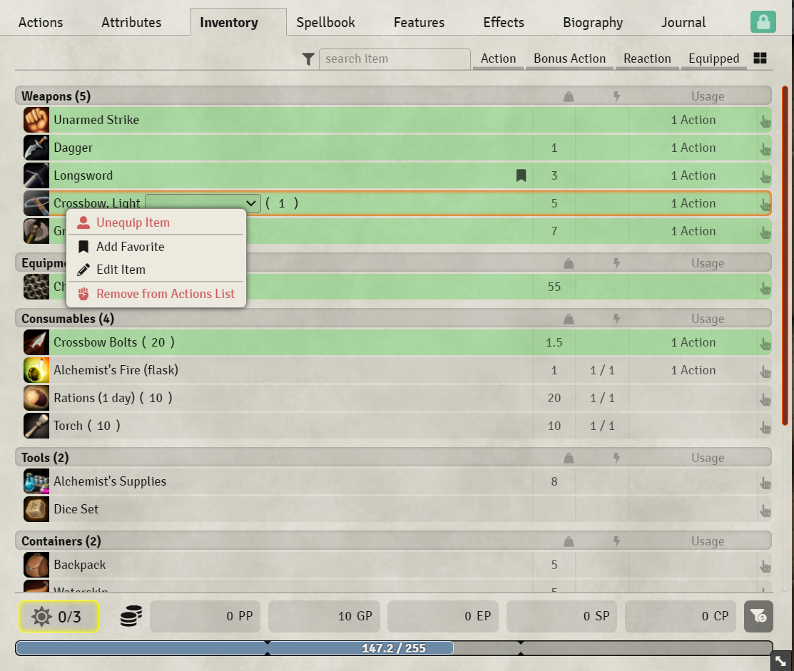

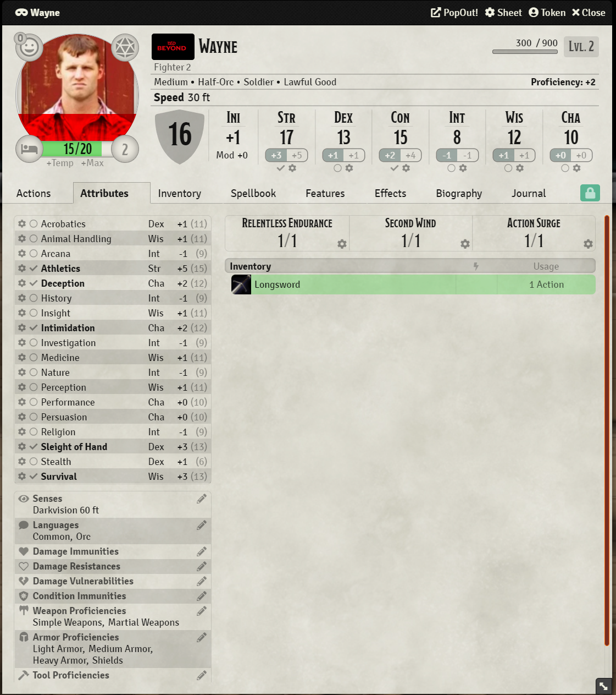

1. Skill checks - Click on any of the attributes, same rules for applying advantage/disadvantage as attacking. These can also be added to your hotbar if you make them all the time. 

## Resting

1. Open your character sheet and select the bed icon on the bottom right of your icon, then choose short or long rest.

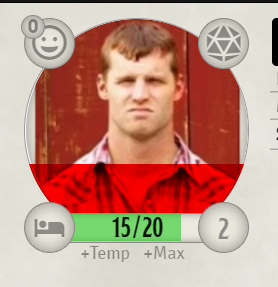

## Keyboard Shortcuts

Open configure controls on settings panel on the right side to view your keyboard shortcuts. You can also modify them from this page. 

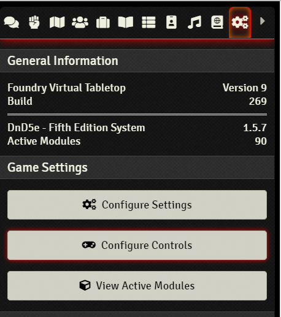

## Performance Issues

Is your machine/browser struggling with performance issues?

1. Click configure settings on the settings panel on the right side 

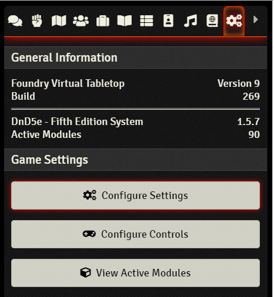

2. Change performance mode to medium or low (probably start by going to medium) and switch your maximum framerate to something like 20 - 30

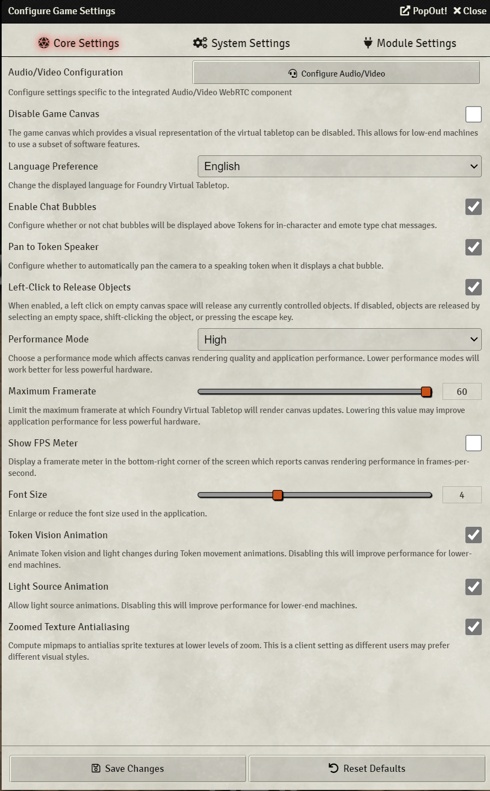

3. If things are still struggling, make sure you follow the instructions on [this page](https://prezi.com/view/Wpq1WQv92LC1KNwwAEyG/) to ensure your computer and browser are taking advantage of your machine fully.