# FoundryVTTWiki
A set of wikis for using FoundryVTT within my VTT games.
## Table of Contents

<!-- @import "[TOC]" {cmd="toc" depthFrom=1 depthTo=6 orderedList=false} -->

<!-- code_chunk_output -->

- [FoundryVTTWiki](#foundryvttwiki)
  - [Table of Contents](#table-of-contents)
  - [Logging in](#logging-in)
  - [Audio/Video](#audiovideo)
  - [Opening your character sheet](#opening-your-character-sheet)
  - [Importing your character](#importing-your-character)
  - [Populating/using the hotbar](#populatingusing-the-hotbar)
  - [Combat](#combat)
  - [Character Sheet](#character-sheet)
  - [Resting](#resting)
  - [Keyboard Shortcuts](#keyboard-shortcuts)
  - [Performance Issues](#performance-issues)
  - [Canvas/Navigation Bar](#canvasnavigation-bar)
  - [Token HUD](#token-hud)
  - [Argon Combat HUD](#argon-combat-hud)

<!-- /code_chunk_output -->

## Logging in

Choose your user and login with your password (shared offline).

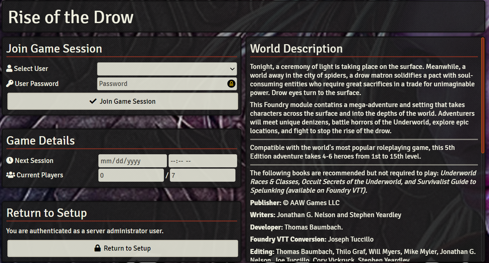

## Audio/Video

HELP! My A/V isn't working!

1. From your video screen icon, click the gear icon on the left

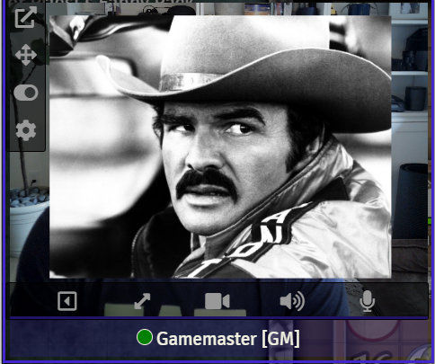

2. Ensure "Audio/Video Enabled" is selected and Voice Broadcasting mode is "Always Enabled", unless you are familiar with and prefer Push-To-Talk.

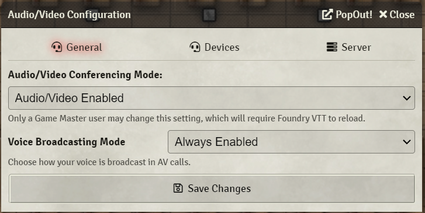

3. Ensure your correct video, audio input/output devices are selected here.

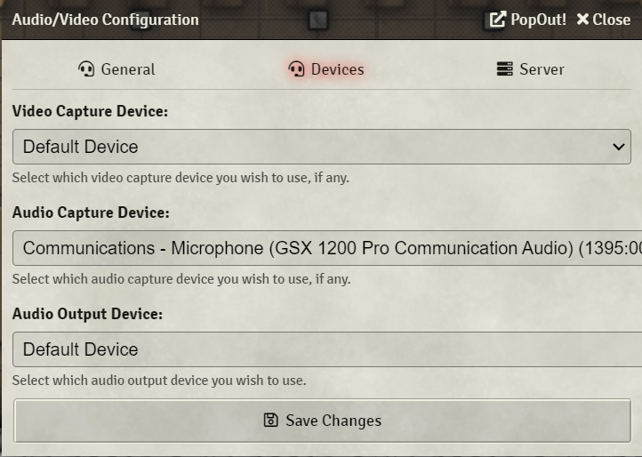

4. Ensure you aren't muted (bottom row, right microphone icon), that others aren't muted (bottom row, second from right speaker icon) and video is enabled (bottom row, middle camera icon)

For reference when those aren't enabled this is what it looks like. 

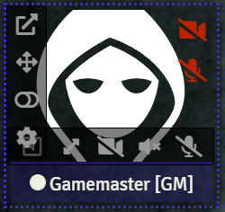

5. How do I look like that man above? Sorry, we can't all be Burt Reynolds.

## Opening your character sheet

1. Find your token on the map and double click

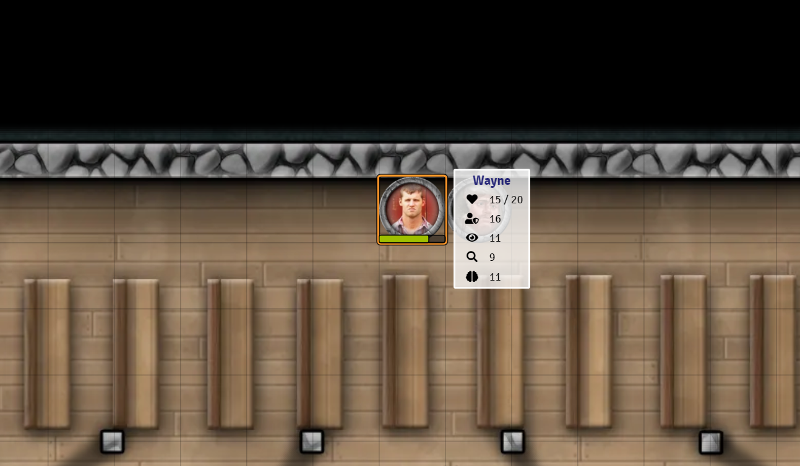

2. Find your actor on the actor tab

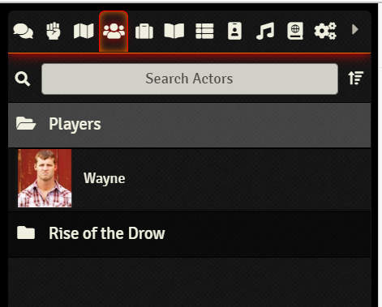

## Importing your character

So you updated your character on D&D beyond and want to pull changes over to foundry? Great!

1. Click on the black D&D Beyond button next to your character name

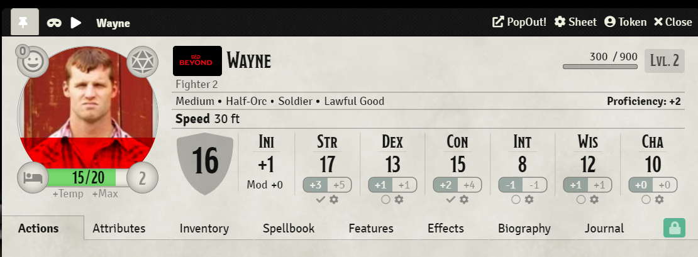

2. Click on start import. Don't press anything else in this window unless you know what you're doing. 😃

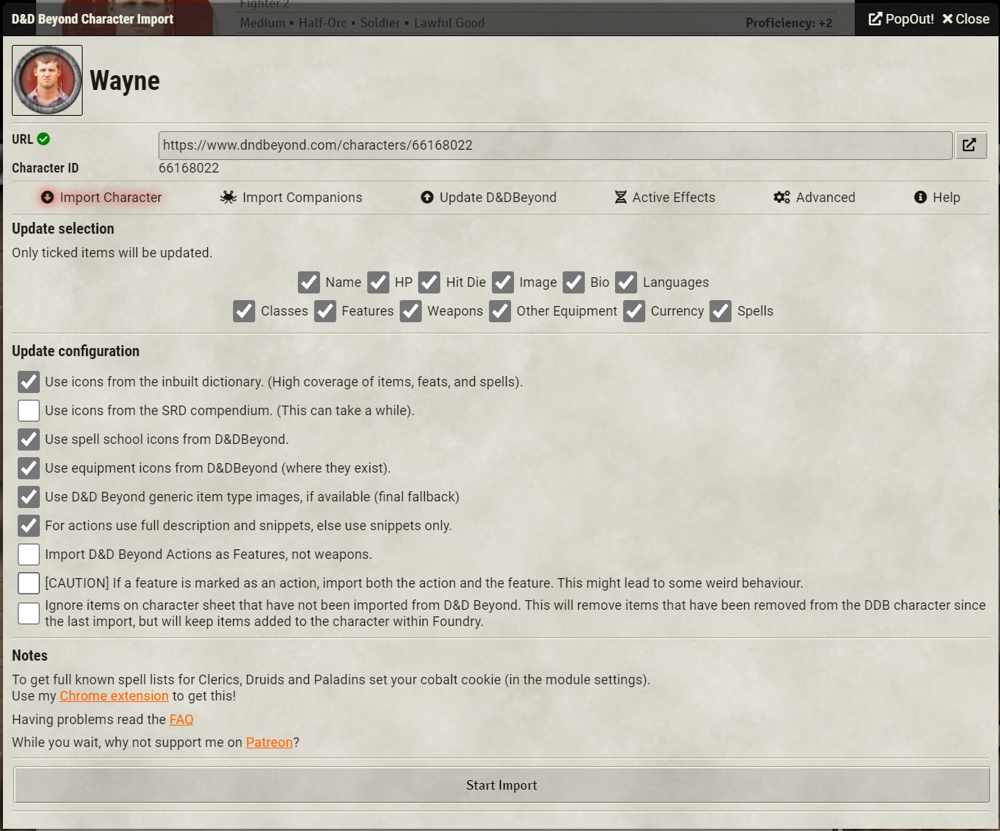

## Populating/using the hotbar

1. To add an item to the hotbar, click and drag the item from your character sheet and drop it into the slot you want it on the hotbar

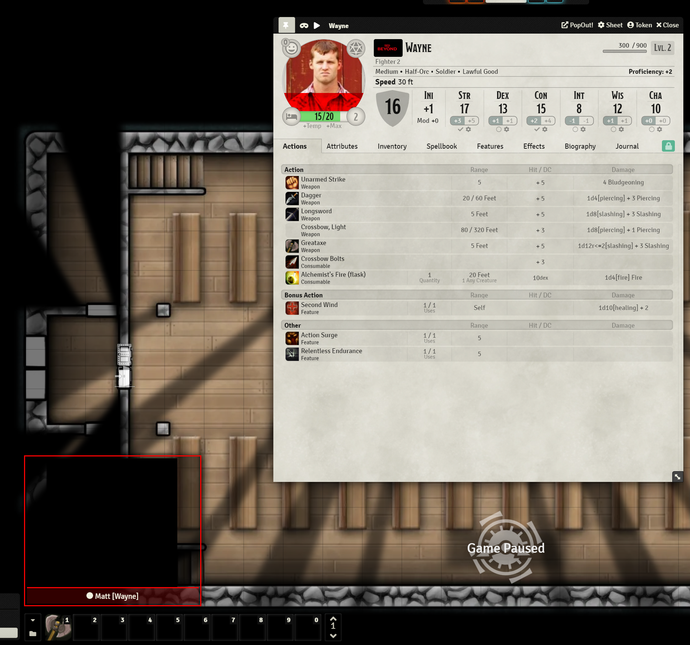

2. Click on the item to use it. That's it! Advantage/disadvantage modifiers also apply here. 

3. Click on number on the very right side of the hotbar to have it fly out and expand. You can setup up to 5 hotbars of items. If you need more than that, you might have a problem but talk to me. 😃

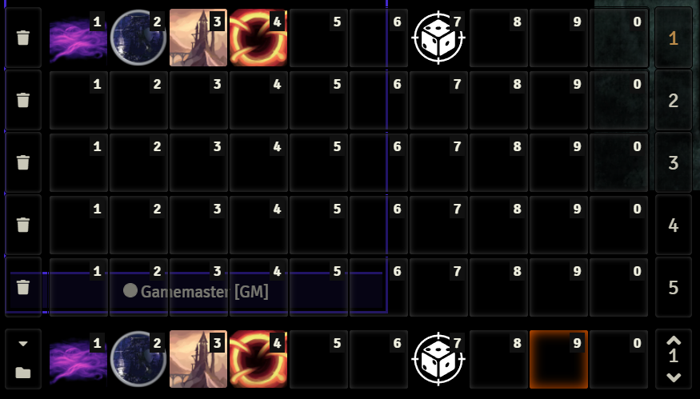

## Combat

1. Initiative - When the DM says so, click the "Ini" button right next to your AC.

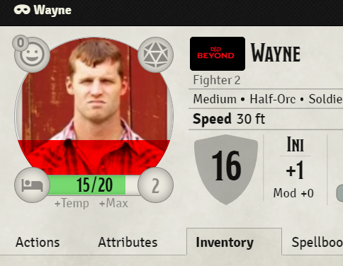

2. Targeting is *required* for making attacks in combat. In order to target, hold ALT (Windows) or OPTION (MacOS) and select the enemy token to attack. This allows me, as DM, to setup a lot more automation so combat moves more smoothly. You will end up with a target on the character token you are attempting to attack. Now you can roll your attack. You won't be able to attack unless you do this!

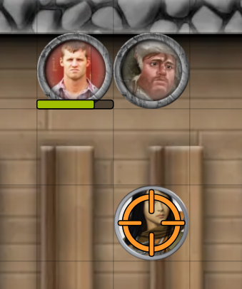

3. Attacking - After targeting, choose your attack and click on either the hotbar or on your charater sheet to roll. Everything should happen automatically. If you were successful, you will see a card like this, which show you what your attack/damage rolls were. You can click on either of the roll formulas to see exactly what dice were rolled. 

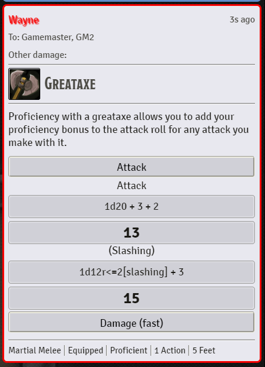

4. Advantage/disadvantage - Rolling with advantage can be achieved by holding ## shift** while clicking your attack button/hotbar. Rolling with disadvantage can be achieved by holding **control (Windows)/command (MacOS) while clicking your attack button/hotbar. Using a versatile attack can be done by holding V while attacking. Versatile attacks are like for a Longsword which can be wielded with 1 or 2 hands. The versatile attack would be done with 2 hands. If you want 2-handed to be the default and 1-handed to be versatile, talk with me and we can get this fixed up. 😃

5. Movement - When it is your turn, drag and drop your token to where you want to go. If your movement is being restricted, possibly by a wall or other charater, move around those. While moving your token, you can see how far you have moved so far this turn. Green represents your normal movement speed (unless in difficult terrain), yellow would be if you have the ability to dash, either as a Bonus Action like a Rogue/Monk with Ki or as an Action dash. 
a. Click your space bar to add waypoints to your move if you want to maneuver around walls. Right click to undo creating those waypoints.
b. If you still can't get your token to move, either tell the DM to unpause the game, get it back on your turn or just have them move you. 😃

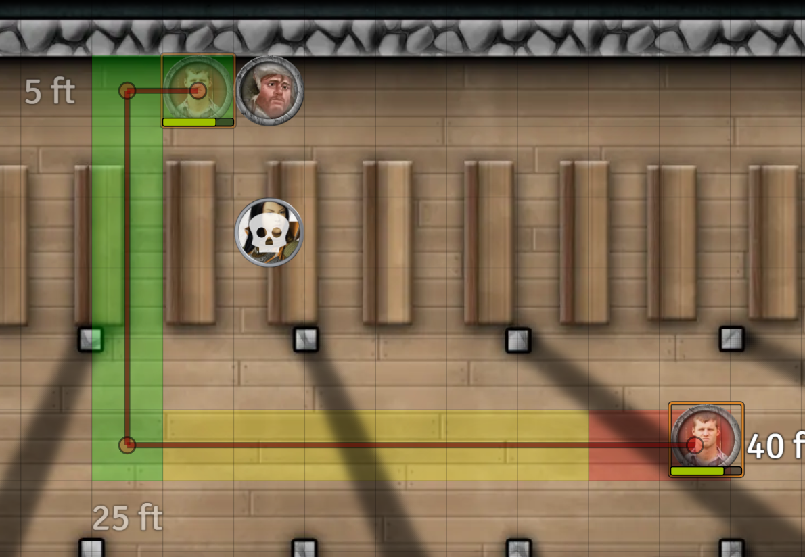

## Character Sheet

0. Help! I can't modify my character sheet to do XYZ! Make sure the green lock on the bottom right is switched to red.
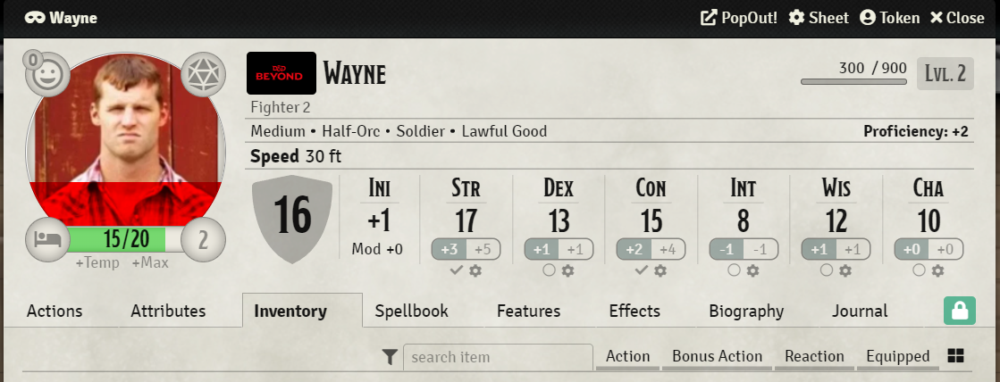

1. Adding favorites - Right click an item on your sheet and select "Add Favorite" to get it added to show up in the Attributes page. The Actions page is pre-populated with a bunch of combat-specific actions but you can also add stuff by going to the inventory tab and doing a right click on an item and selecting "Add to Actions List"

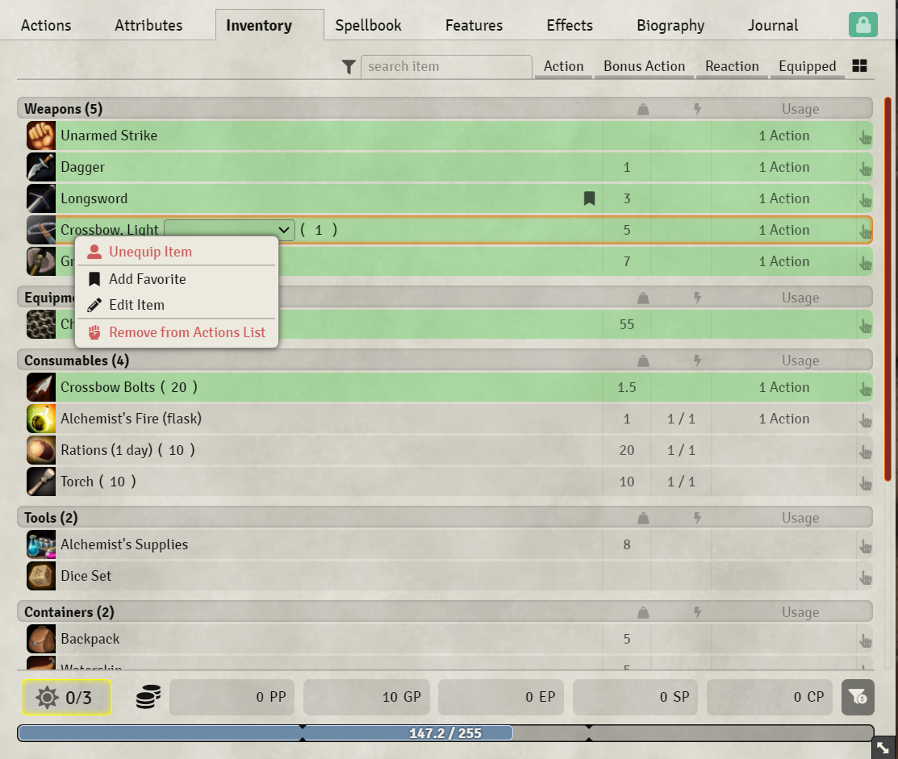

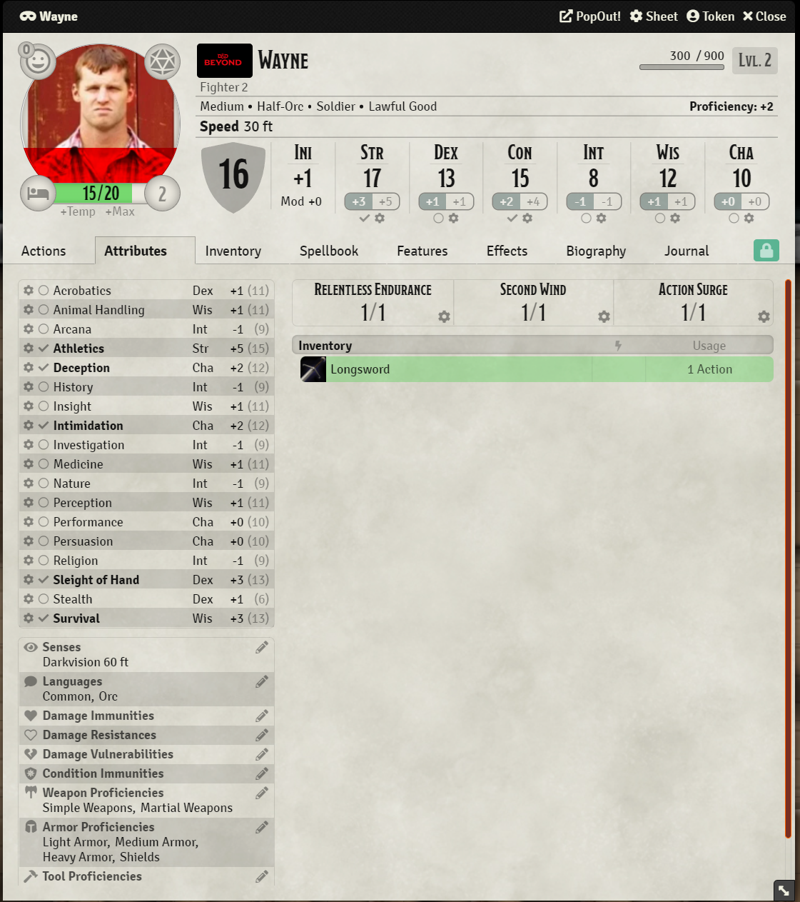

2. Skill checks - Click on any of the attributes, same rules for applying advantage/disadvantage as attacking. These can also be added to your hotbar if you make them all the time. 

3. Modifying your avatar/token - Click the image to replace your token image. There are plenty of controls to paste in images, reference the web, etc. Go wild! If you want a super fancy looking token, talk to the DM. 😃

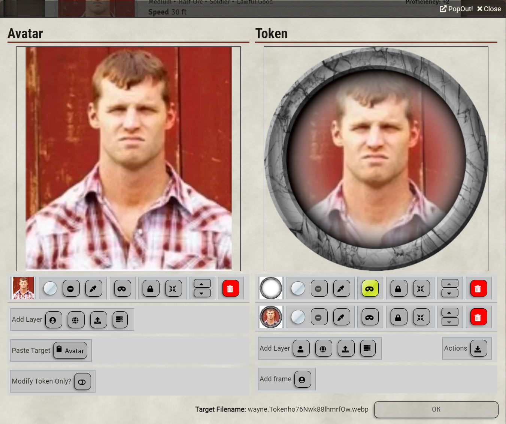

4. Adding items - For the particular secion you want to add to, once the lock icon is red, click the magnifying glass and start typing to select an item

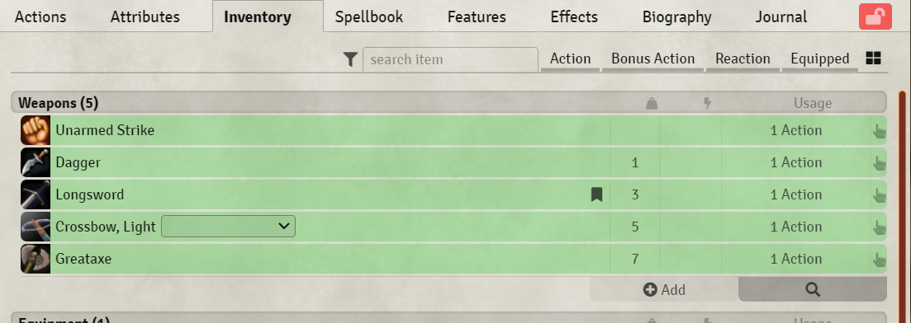

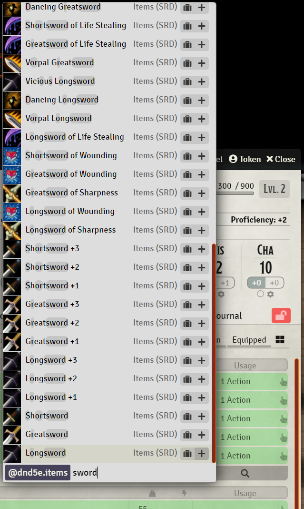

5. Equipping items - Right click the item on the sheet, click equip.

6. My character has special class feature Foo to keep track of uses - These are normally on the attributes page. As an example, the 2nd level half-orc fighter has relentless endurance, second wind and action surge to keep track of. This can be configured on D&D Beyond character import (see [Importing your character](#importing-your-character)

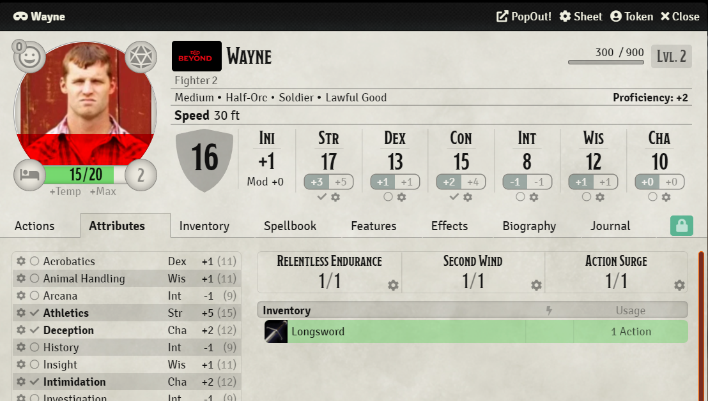

7. How many spell slots do I have? - Open your character sheet, click spellbook.

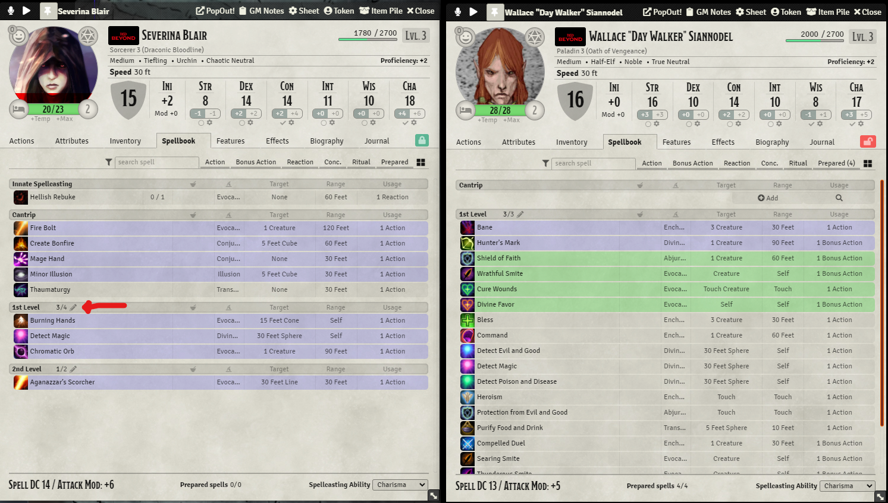

## Resting

1. Open your character sheet and select the bed icon on the bottom right of your icon, then choose short or long rest.

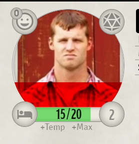

## Keyboard Shortcuts

Open configure controls on settings panel on the right side to view your keyboard shortcuts. You can also modify them from this page. 

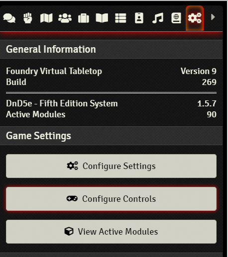

## Performance Issues

Is your machine/browser struggling with performance issues?

1. Click configure settings on the settings panel on the right side 

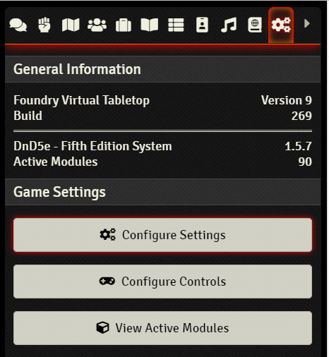

2. Change performance mode to medium or low (probably start by going to medium) and switch your maximum framerate to something like 20 - 30

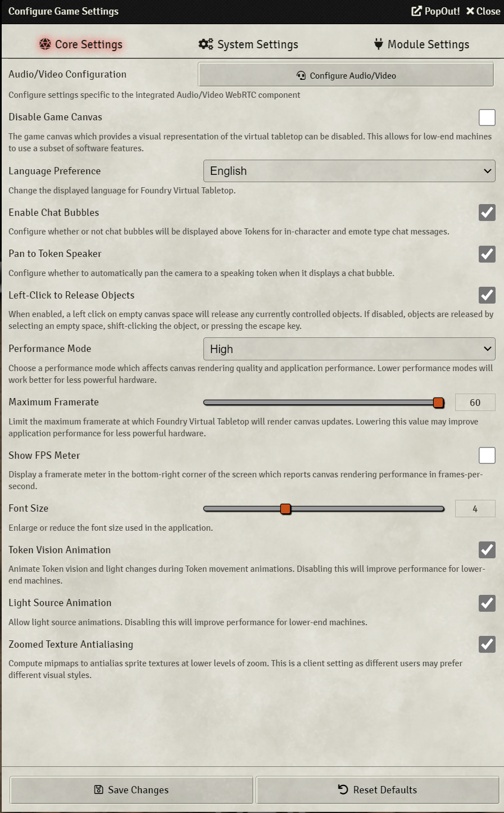

3. If things are still struggling, make sure you follow the instructions on [this page](https://prezi.com/view/Wpq1WQv92LC1KNwwAEyG/) to ensure your computer and browser are taking advantage of your machine fully.

## Canvas/Navigation Bar

1. Token Controls - 99% of the time and when wanting to move your token or, you should ensure the Token Controls and Select Token tool are selected.

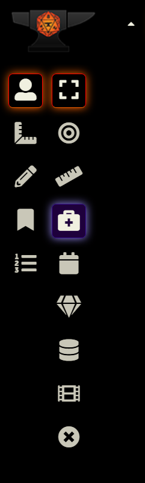

a. Always HP Dialog - This handy little dialog can be hidden if you don't use it to control HP, or aren't in combat to need to add/subtract hitpoints from your player. Click on the medical briefcase to make it disappear. HP can also be managed from the character sheet. 

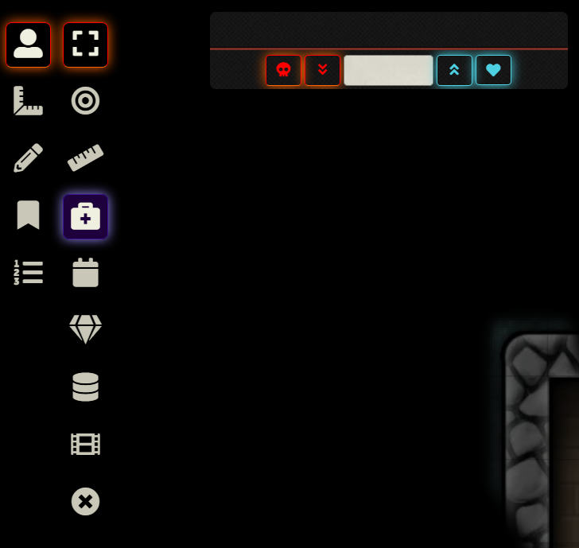

2. Measurement Controls - Sometimes, like if you are a spellcaster figuring out where they could cast a spell, you need measurement controls. There are four templates (example spells in parenthesis): Circle (fireball), cone (cone of cold), rectangle (Thunderwave) and ray (Lightning Bolt). Just make sure you select and delete these once you're done measuring. Else you end up with your screen looking like this.

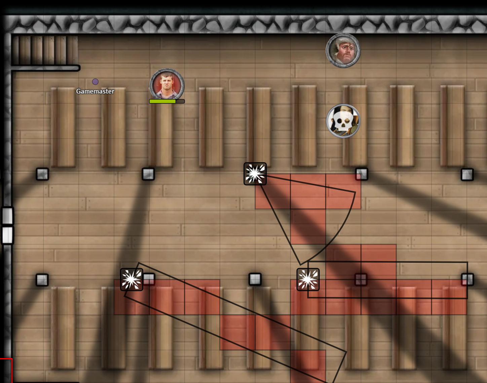

3. Drawing Tools - If you want to draw a shape, write text on a canvas, draw freehand to make a point, this is the place to do it. Same as before, just make sure you clean up what you don't want there long term before you switch back to token controls.

4. Journal Notes - You probably won't use this set of controls.

5. Sequencer Layer - You definitely won't use this set of controls. 

## Token HUD

1. Lighting a torch - Right click on your token, click the flame icon on the upper right.

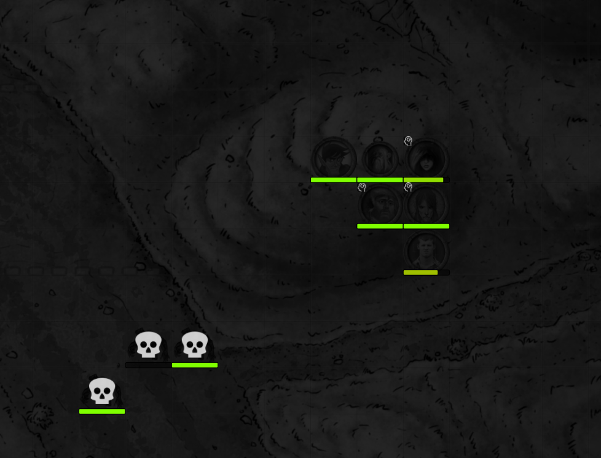

## Argon Combat HUD

1. Setting up equipment sets - Open your character sheet and drag the weapon/item you want to create an equipment set into one of the set of boxes above your character image. Each is a set of two, so you can equip two one-handed items or one two-handed item. In this video I create one set with a glaive and one with a longsword and shield.

2. Toggling the combat HUD - Right click your token and click the two swords in the upper left, right below torch OR click the same icon on the upper left in the token controls

3. Switching sets and attacking - Click on the different set you want to equip. You'll notice that your items are correctly equipped, your AC changes (if appropriate). Then click on the icon of the weapon you want to attack with and it'll make the attack role with the weapon you currently have equipped. Advantage/Disadvantage rules apply.

3. Casting spells and using class features - Click on spells. It'll pop up the spells you have equipped. You can see how many spell slots of each type you have. You can also use items or see different features you have available as a bonus action.

4. The combat HUD is too big - Go to settings, module settings and change the scale to be something smaller. Make sure to toggle the HUD on/off and it'll resize. 

