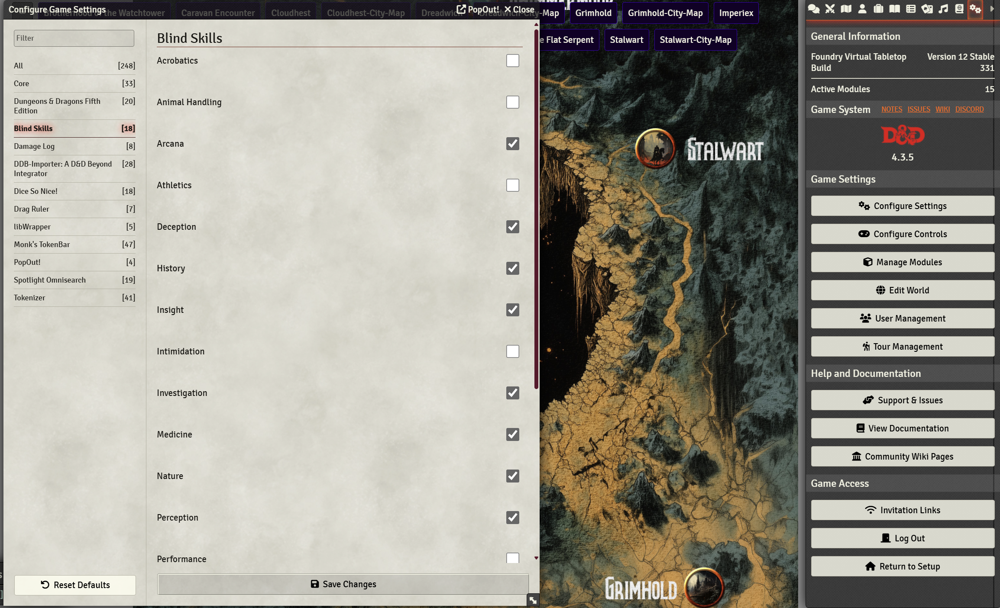
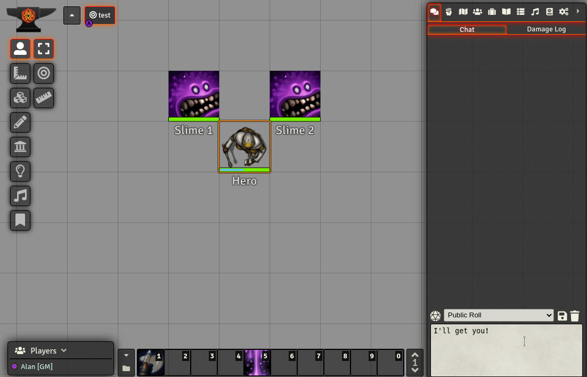
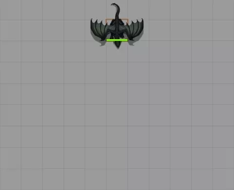
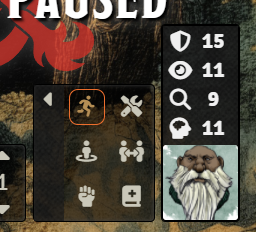
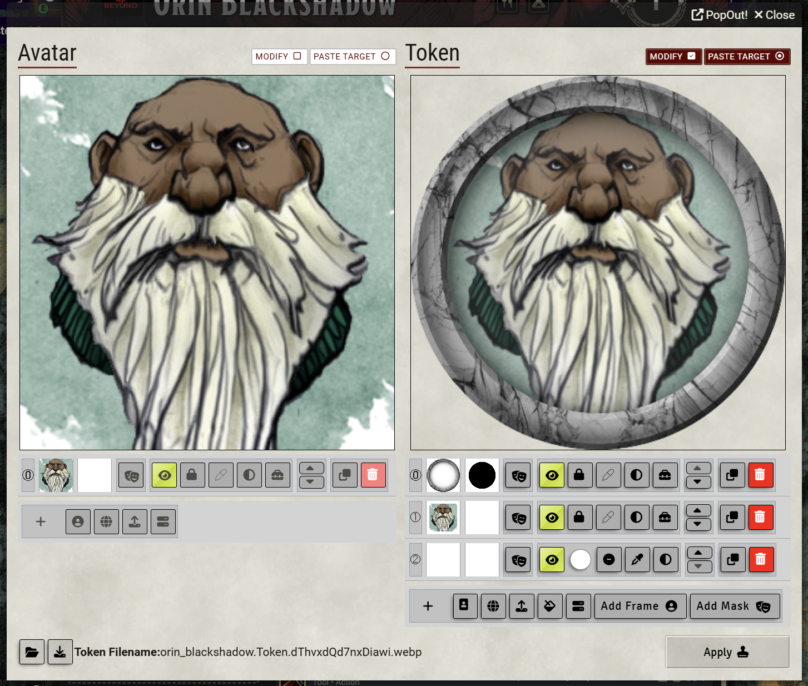

# Rylak Modules

- [Rylak Modules](#rylak-modules)
  - [Blind Rolls](#blind-rolls)
  - [Damage Log](#damage-log)
  - [Dice Tray](#dice-tray)
  - [Drag Ruler / DnD5e Drag Ruler Integration](#drag-ruler--dnd5e-drag-ruler-integration)
  - [Monk's Token Bar](#monks-token-bar)
  - [Spotlight Omnisearch](#spotlight-omnisearch)
  - [Tokenizer](#tokenizer)

## Blind Rolls

Where to setup blind roll settings. The GM will see the result of the roll but players won't if a box is checked.

## Damage Log

Module will show all damage that has happened to all PCs/NPCs and give the option to undo the damage as well.

https://foundryvtt.com/packages/damage-log

## Dice Tray

Click the buttons to roll custom dice. It'll build the formula for you and you can add on to it as you so wish.

## Drag Ruler / DnD5e Drag Ruler Integration

Press space while dragging your token to set waypoints as you are moving like in the picture. 

https://foundryvtt.com/packages/drag-ruler
https://foundryvtt.com/packages/elevation-drag-ruler

## Monk's Token Bar

🛡️ - AC
👁️ - Passive perception
🔍 - Passive investigation
🧠 - Passive insight

https://foundryvtt.com/packages/monks-tokenbar

## Spotlight Omnisearch

https://foundryvtt.com/packages/spotlight-omnisearch

## Tokenizer

Click edit button (wrench) on upper left of the character sheet, then click on the user avatar. This will 

https://foundryvtt.com/packages/vtta-tokenizer